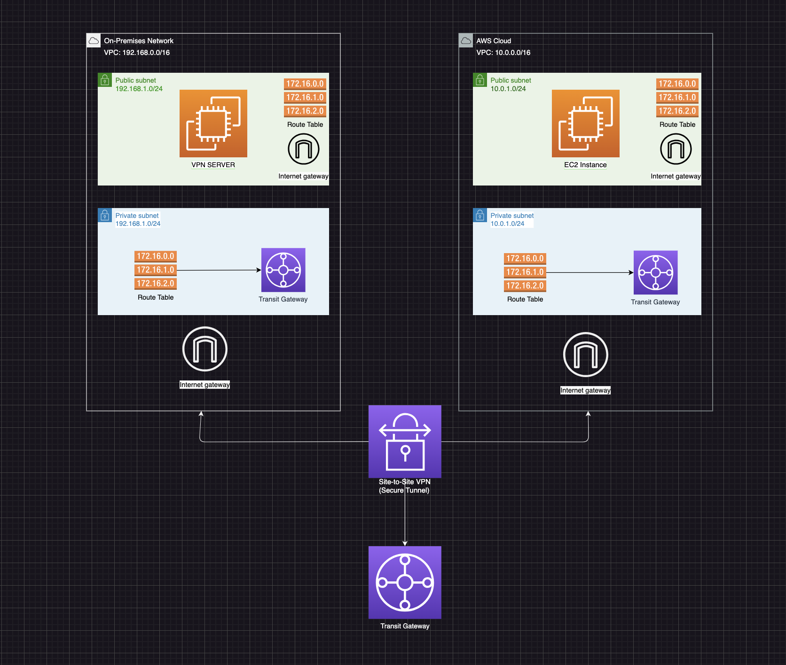

# Hybrid Cloud Networking with AWS, Terraform, and Ansible

[](https://aws.amazon.com)
[](https://www.terraform.io)
[](https://www.ansible.com)

This project automates the deployment of a hybrid cloud network connecting an on-premises environment (simulated with AWS) to AWS using:
- **Site-to-Site VPN**
- **Transit Gateway**
- **AWS Network Firewall**
- **VPC Flow Logs**

## 📋 Table of Contents
- [Architecture](#architecture)
- [Prerequisites](#prerequisites)
- [Usage](#usage)
- [Deliverables](#deliverables)
- [Contributing](#contributing)
- [License](#license)

## 🏗 Architecture


Key components:
1. **Simulated On-Premises VPC** (`192.168.0.0/16`) with a VPN server.
2. **AWS VPC** (`10.0.0.0/16`) with public/private subnets.
3. **Transit Gateway** for inter-VPC routing.
4. **Network Firewall** blocking SSH from the public internet.
5. **VPC Flow Logs** stored in S3.

## 🛠 Prerequisites
- [AWS Account](https://aws.amazon.com/free) (Free Tier)
- [AWS CLI](https://aws.amazon.com/cli/) configured
- [Terraform](https://www.terraform.io/downloads) v1.5+
- [Ansible](https://docs.ansible.com/ansible/latest/installation_guide/index.html) v2.12+
- SSH Key Pair (created in AWS)

## 🚀 Usage

### Step 1: Clone the Repository
```bash
git clone https://github.com/your-username/hybrid-cloud-aws.git
cd hybrid-cloud-aws
```
### Step 2: Configure AWS and Terraform
1. Copy the example Terraform variables file:
```bash
cp terraform/terraform.tfvars.example terraform/terraform.tfvars
```


2. Update ```terraform/terraform.tfvars```:
```bash
aws_region    = "us-east-1"
ssh_key_name  = "your-aws-key-pair-name"
my_ip         = "your-public-ip/32"  # Get from https://ifconfig.me
```

### Step 3: Deploy Infrastructure
```bash
cd terraform
terraform init
terraform plan -out=tfplan
terraform apply tfplan
```
### Step 4: Configure Ansible
1. Copy the example Ansible inventory:
```bash
cp ansible/inventory.ini.example ansible/inventory.ini
```
2. Update ```ansible/inventory.ini``` with instance IPs from Terraform outputs:
```bash
terraform output -json
```

### Step 5: Run Ansible Playbook
```bash
ansible-playbook -i ansible/inventory.ini ansible/playbook.yml \
  --private-key ~/.ssh/your-private-key.pem \
  -u ec2-user
```
### 📄 Deliverables
1. Traceroute between on-prem and AWS instances:

```bash
traceroute <private-ip-of-aws-instance>
```
2. Screenshots:


### 🤝 Contributing
See [CONTRIBUTING.md](CONTRIBUTING.md) for guidelines.

### 📜 License
This project is licensed under the Apache License 2.0.


